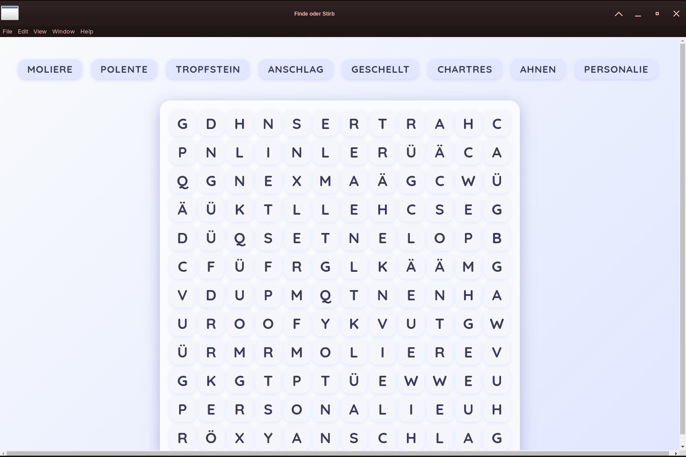

# Suchsel 

**Suchsel* – das ultimative Suchsel für Wortakrobaten!

Die Anwendung bietet ein ansprechendes, responsives Design und ist sowohl als Web-App als auch als Desktop-App (z.B. mit Electron) nutzbar.

## Features
- **Intuitive Oberfläche:** Modernes, farbenfrohes UI mit Animationen
- **Schweizer Wörterbuch:** Enthält viele schweizerdeutsche Begriffe
- **Responsiv:** Funktioniert auf Desktop und Mobilgeräten
- **Schneller Einstieg:** Einfach starten, Wörter suchen und finden
- **Optional Electron:** Auch als Desktop-App nutzbar

## Vorschau
Das Suchsel sieht z.B. so aus:


## Projektstruktur
- **main.js**: Hauptlogik der Anwendung
- **suchsel-tools.js**: Hilfsfunktionen für das Suchsel
- **suchsel.html**: HTML-Oberfläche
- **preload.js**: Preload-Skript (z.B. für Electron)
- **deutsche_woerter_schweiz.dic**: Wörterbuchdatei
- **starte-suchsel.sh**: Startskript für das Projekt
- **package.json**: Projekt- und Abhängigkeitsverwaltung

## Voraussetzungen
- Node.js (empfohlen: aktuelle LTS-Version)

## Installation
1. Repository klonen oder Dateien herunterladen.
2. Im Projektverzeichnis im Terminal ausführen:
   ```
   npm install
   ```

## Starten
- Mit dem Shell-Skript:
  ```
  ./starte-suchsel.sh
  ```
- Oder direkt mit Node.js:
  ```
  node main.js
  ```

## Hinweise
- Die Anwendung nutzt ein Wörterbuch mit schweizerdeutschen Begriffen.
- Für die Nutzung als Desktop-App kann Electron verwendet werden (optional).

## Lizenz
MIT License
